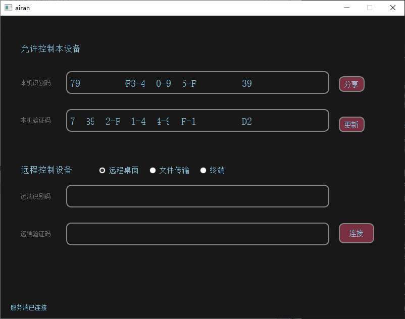
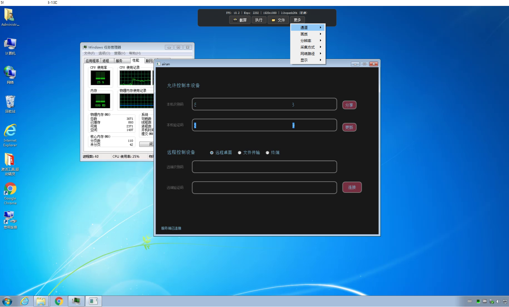
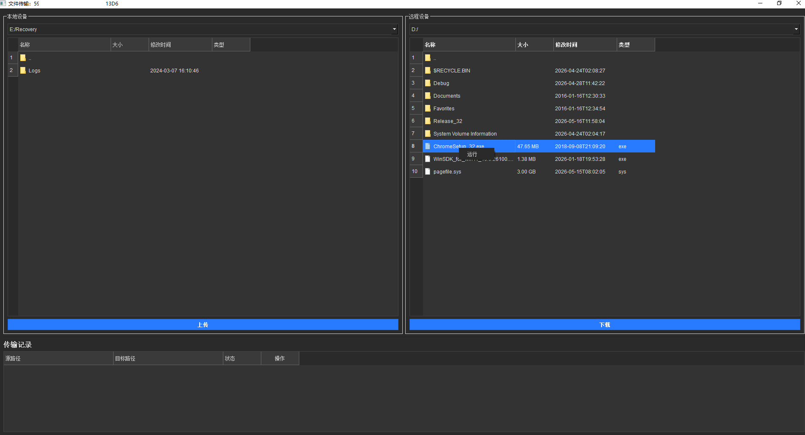
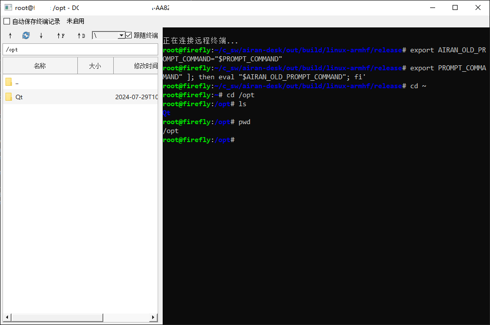
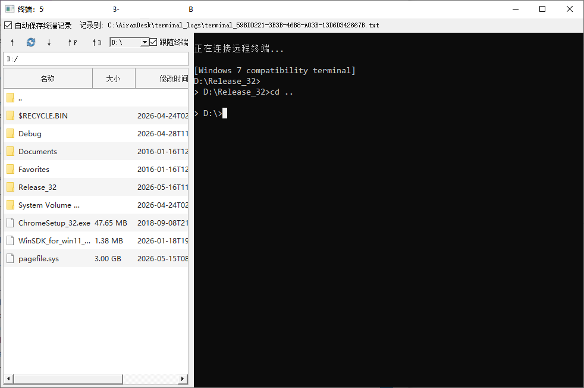
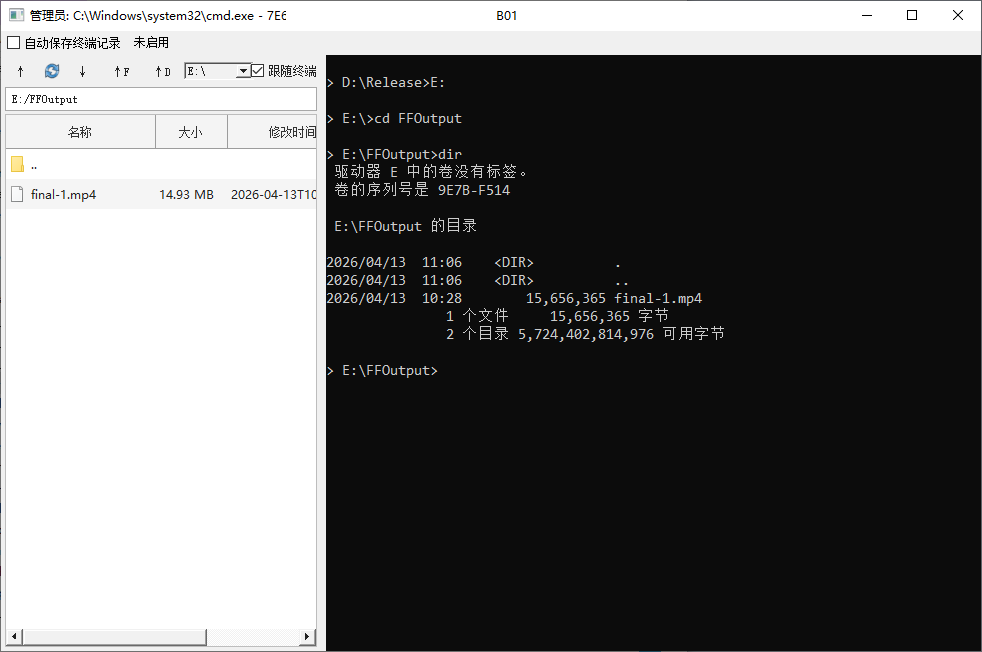

# airan-desk

[简体中文](README.md) | English

airan-desk is a WebRTC-based remote desktop control application. It supports desktop streaming, remote keyboard and mouse control, file transfer, and a remote terminal. The project targets Windows, Linux, and macOS.

## Overview

- Built with **Qt5 + WebRTC (libdatachannel) + FFmpeg**
- Remote desktop viewing and control
- File transfer
- Remote terminal support, using Windows ConPTY or Linux/macOS forkpty to launch the system shell and native `libvterm + Qt Widgets` rendering for full-screen TUI programs
- Windows zero-copy encoding support, depending on GPU driver and platform capability
- UI localization through Qt `.ts`/`.qm` translation files

> Note: `CMakePresets.json` still requires **CMake 3.21+**. If your CMake version is 3.10 to 3.20, use the traditional `cmake` command workflow.

## Platform Capability Matrix

| Platform / Session | Capture Backend | Frame-rate Cap | Notes |
| --- | --- | --- | --- |
| Windows 10 1903+ (build ≥ 18362) | WGC (GPU zero-copy) → Qt | Uncapped | Prefers the `airan_capture_wgc` plugin; falls back to Qt if it fails |
| Windows 7 / 8 / 8.1 / early Win10 | Qt (CPU GDI) | **15 fps** | WGC is not available; the cap avoids CPU saturation |
| Linux X11 | Qt (X11 grab) | Uncapped | Default path; no portal dependency |
| Linux Wayland | PipeWire + xdg-desktop-portal → Qt | Uncapped | In `auto` mode it kicks in when `WAYLAND_DISPLAY` / `XDG_SESSION_TYPE=wayland` is set; the first session triggers a portal authorization dialog |
| macOS | Qt | Uncapped | Requires "Screen Recording" and "Accessibility" permissions |

`conf/common.ini` exposes `captureBackend`, accepting `auto` (default) / `wgc` / `qt` / `pipewire`. Unknown values fall back to `auto`.

> The Wayland backend is a compile-time option. The build host needs `libpipewire-0.3` and Qt5 DBus to enable it. If they are missing, CMake prints `PipeWire screen-capture backend disabled` and the runtime falls back to Qt+X11.

## Tested Environments

### Windows 7 32-bit

- FFmpeg 7.1.3 + Qt 5.9.9
- FFmpeg 7.1.3 + Qt 5.15.2

### Windows 10 64-bit

- FFmpeg 7.1.3 + Qt 5.9.9
- FFmpeg 7.1.3 + Qt 5.15.2

### Ubuntu 18.04 armhf

- FFmpeg 4.1.4 + Qt 5.9.5 installed via apt

### Ubuntu 22.04 x64

- FFmpeg 4.4.2 + Qt 5.15.3 installed via apt

## Screenshots








## Build Docs

- [Windows build guide](doc/build_win.en.md)
- [Linux build guide, including x86 / x64 / arm64 / armhf](doc/build_linux.en.md)
- [macOS build guide](doc/build_mac.en.md)

The Linux guide covers:

- `linux-x86`
- `linux-x64`
- `linux-arm64`
- `linux-armhf`

## Usage

### Before Launching

1. Enter the program output directory.
2. Make sure these resources exist:
   - `conf/config.ini`
   - `locale/`
3. Edit `conf/config.ini` and configure at least:
   - `signal_server.wsUrl=your signaling server URL`

Example:

```ini
[signal_server]
wsUrl=wss://your-signal-server.example/ws
```

### Language

The UI language is configured in `conf/common.ini`:

```ini
[local]
language = auto
```

Supported values:

- `auto`: follow the system language, using Simplified Chinese for Chinese systems and English otherwise
- `zh_CN`: Simplified Chinese
- `en_US`: English

Translation files are deployed to `locale/` as `airan-desk_*.qm`. The existing Qt base translation files, such as `qtbase_zh_CN.qm`, are also loaded from the same directory when available.

### Launching

- Windows: run `release\airan-desk.exe`
- Linux: run `./airan-desk` from the output directory
- macOS: prefer running `airan-desk.app`

### macOS Notes

The macOS version currently provides build scripts and code paths following the usual Qt/macOS workflow, but it has not been tested on real macOS hardware yet. On first launch, you usually still need to manually grant:

- Screen Recording permission
- Accessibility permission
- Permission to run an unsigned app

See the [macOS build guide](doc/build_mac.en.md).

### Basic Workflow

1. Start the controlled-side and controller-side programs.
2. Make sure both sides can access the same signaling server.
3. On the controller side, enter the target connection information and start the connection.
4. After the connection succeeds, you can view the remote desktop and control keyboard and mouse input.
5. To transfer files, open the file transfer window and send files from there.
6. To use a remote command line, choose the Terminal mode. Full-screen TUI programs such as `vim`, `top`, and `htop` are handled through PTY/ConPTY plus the native terminal emulator.

## Dependencies

Main dependencies:

- [Qt5](https://www.qt.io/): cross-platform GUI, networking, and localization foundation. Thanks to The Qt Company and the Qt community.
- [libdatachannel](https://github.com/paullouisageneau/libdatachannel): WebRTC data channel and media transport. Thanks to Paul-Louis Ageneau and contributors.
- [spdlog](https://github.com/gabime/spdlog): logging library. Thanks to Gabi Melman and contributors.
- [FFmpeg](https://github.com/FFmpeg/FFmpeg): audio/video codec and format handling. Thanks to the FFmpeg project team and contributors.
- [libvterm](https://github.com/neovim/libvterm): terminal escape sequence parsing and screen state handling. Thanks to Paul Evans, the Neovim maintainers, and contributors.

The remote terminal UI is a native Qt Widgets component and does not depend on `QtWebEngine`.

Third-party source dependencies are managed with Git submodules. After cloning or when updating dependencies, run:

```bash
git submodule update --init --recursive
```

## License

See [LICENSE](LICENSE).
